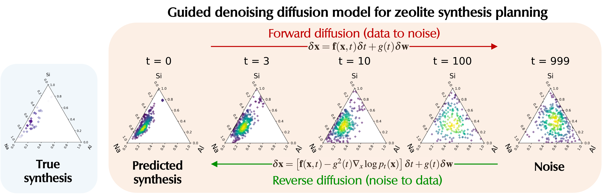
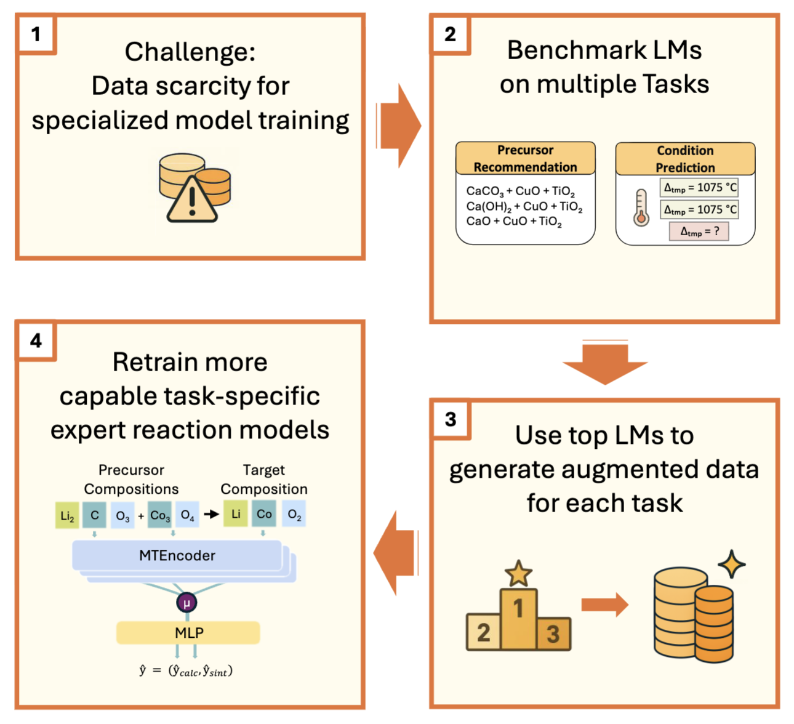
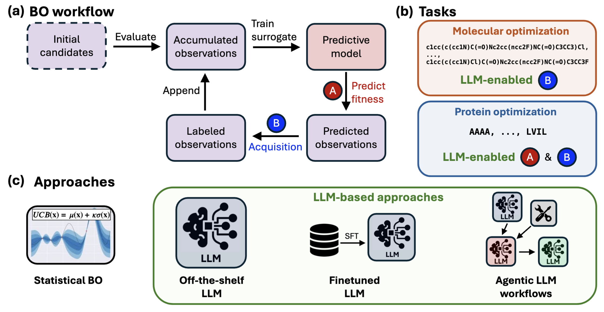
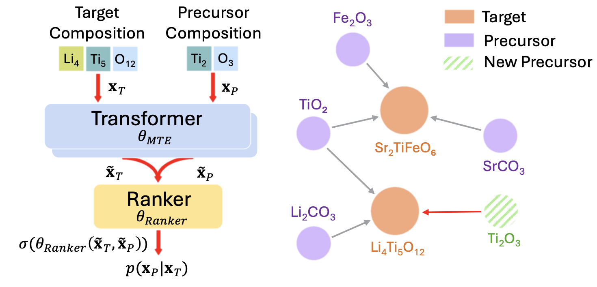
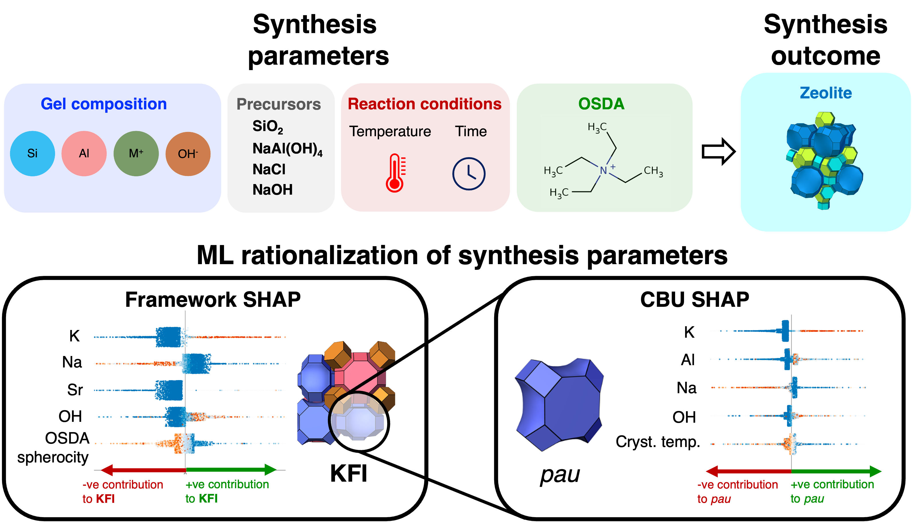
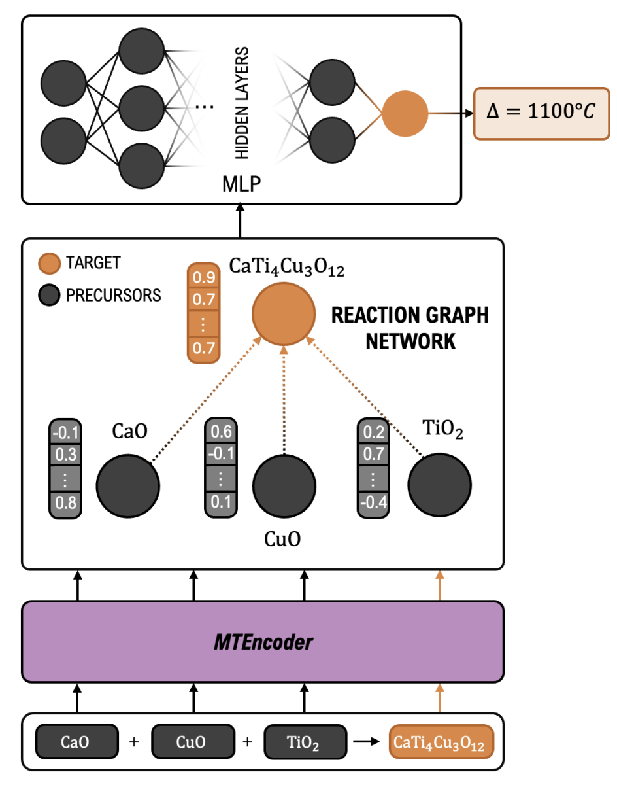

<h3 align="left">Hi 👋 I'm Elton Pan</h3> 

My research interests are **ML for materials science and chemistry**, particularly **materials synthesis**, **generative models** and **LLMs**.  Beyond ML for science, I had the privilege of working as an **AI Researcher** at **Meta** and **Google Research** on **diffusion models and transformers**. I was also incredibly lucky to receive the **MIT Presidential Fellowship** for my PhD, and for my research to be featured on **MIT News**.

  

<h3 align="left">Work experience</h3>

<table style="border: none; border-collapse: collapse;">
<tbody style="border: none;">
<tr style="border: none;">
<td width="100" align="center" style="border: none;"></td>
<td style="border: none;">
<b>MIT</b> 
<i>PhD Researcher</i> | Cambridge, MA 
<i>Sep 2021 – Present</i>
<ul>
<li>Advisor: Elsa Olivetti Collaborators: Rafael Gomez-Bombarelli, Yuriy Roman-Leshkov, Manuel Moliner, Jennifer Rupp</li>
<li>MIT Presidential Fellowship</li>
</ul>
</td>
</tr>

<tr style="border: none;">
<td width="100" align="center" style="border: none;"></td>
<td style="border: none;">
<b>Meta</b> 
<i>AI Research Scientist</i> | Sunnyvale, CA 
<i>June 2025 – Aug 2025</i>
<ul>
<li>Foundational AI and Codesign team (internship): Self-feedback for transformers</li>
</ul>
</td>
</tr>

<tr style="border: none;">
<td width="100" align="center" style="border: none;"></td>
<td style="border: none;">
<b>Google Research</b> 
<i>Research Scientist</i> | Mountain View, CA + Cambridge, MA 
<i>June 2024 – Jan 2025</i>
<ul>
<li>SciML team (internship): Hierarchical controllable diffusion models</li>
</ul>
</td>
</tr>

<tr style="border: none;">
<td width="100" align="center" style="border: none;"></td>
<td style="border: none;">
<b>Ro5</b> 
<i>ML Engineer</i> | London, UK 
<i>Apr 2021 – Jul 2021</i>
<ul>
<li>GNNs + RL for molecular generation</li>
</ul>
</td>
</tr>

<tr style="border: none;">
<td width="100" align="center" style="border: none;"></td>
<td style="border: none;">
<b>Institute of High Performance Computing</b> 
<i>Research Engineer</i> | Singapore 
<i>Jul 2020 – Jul 2021</i>
<ul>
<li>Classical ML for catalysis</li>
</ul>
</td>
</tr>
</tbody>
</table>

<h3 align="left">Projects</h3>

1) ***[Featured on MIT News]*** **Generative diffusion models for materials synthesis planning** using **molecular** and **crystalline materials** datasets (<a href="https://arxiv.org/abs/2509.17094">Nature Computational Science (accepted, under proof), 2025</a> | <a href="https://openreview.net/forum?id=hy39qxU6CQ">NeurIPS (Oral Spotlight) AI for Materials, 2024</a> | <a href="https://github.com/eltonpan/zeosyn_gen">Code</a>)  **Elton Pan**, Soonhyoung Kwon, Sulin Liu, Mingrou Xie, Alexander J Hoffman, Yifei Duan, Thorben Prein, Killian Sheriff, Yuriy Roman-Leshkov, Manuel Moliner, Rafael Gomez-Bombarelli, Elsa Olivetti

  
  

2) **LLMs for materials synthesis planning** for inorganic materials (<a href="https://pubs.acs.org/doi/full/10.1021/acsami.5c11229">ACS Applied Materials & Interfaces </a> | <a href="https://openreview.net/forum?id=Yql4UpgXAI">NeurIPS (Oral Spotlight) AI for Materials, 2025 </a> | <a href="https://github.com/Thorben010/llm_synthesis">Code</a>) Thorben Prein, **Elton Pan**, Janik Jehkul, Steffen Weinmann, Elsa A Olivetti, Jennifer LM Rupp

 

3) **LLM-enabled Bayesian optimization** for molecular / protein optimization (<a href="https://chemrxiv.org/engage/chemrxiv/article-details/69028bd1ef936fb4a216199a">NeurIPS (Spotlight) AI for Science, 2025 </a> | <a href="https://github.com/learningmatter-mit/LLM4BO">Code</a>) Mattias Akke, Soojung Yang, Jurgis Ruza, Jinyeop Song, **Elton Pan**, Rafael Gomez-Bombarelli

 

4) **Transformer-based ranker for synthesis precursor recommendation** for inorganic materials (<a href="https://arxiv.org/abs/2502.04289">Paper</a> | Code in progress) Thorben Prein, **Elton Pan**, Sami Haddouti, Marco Lorenz, Janik Jehkul, Tymoteusz Wilk, Cansu Moran, Menelaos Panagiotis Fotiadis, Artur P Toshev, Elsa Olivetti, Jennifer LM Rupp

 

5) **Synthesis condition prediction** for inorganic materials (<a href="https://pubs.acs.org/doi/full/10.1021/acs.chemmater.2c03010">Chemistry of Materials, 2023</a> | <a href="https://github.com/olivettigroup/interpretable-condition-prediction/">Code</a>) Christopher Karpovich, **Elton Pan**, Zach Jensen, Elsa Olivetti

6) **Model explainability/interpretability** (Aggregated SHAP) for materials synthesis (<a href="https://pubs.acs.org/doi/10.1021/acscentsci.3c01615">ACS Central Science, 2024</a> | <a href="https://github.com/eltonpan/zeosyn_dataset">Code</a>) **Elton Pan**, Soonhyoung Kwon, Zach Jensen, Mingrou Xie, Rafael Gómez-Bombarelli, Manuel Moliner, Yuriy Román-Leshkov, Elsa Olivetti

  
7) **Reinforcement learning** (deep Q-learning, policy gradient) for **inverse design of inorganic materials** (<a href="https://arxiv.org/abs/2210.11931">NeurIPS AI for Materials, 2022</a> | <a href="https://www.nature.com/articles/s41524-024-01474-5">npj Computational Materials, 2024</a> | <a href="https://github.com/eltonpan/RL_materials_generation">Code</a>) **Elton Pan**\*, Christopher Karpovich\*, Elsa Olivetti

8) **Reaction Graph Networks** for modeling precursor-target interactions to predict materials synthesis routes (<a href="https://openreview.net/forum?id=VGsXQOTs1E">NeurIPS AI for Materials, 2024</a> | Code in progress) Thorben Prein, Fuzhan Rahmanian, Kesava Prasad Arul, Jasmin El-Wafi, Menelaos Panagiotis Fotiadis, Jan Heimann, Paul Weinmann, Yifei Duan, **Elton Pan**, Elsa Olivetti, Jennifer LM Rupp

9) **Materials representation learning** (multi-task transformer pretraining) for inorganic materials property/synthesis prediction (<a href="https://openreview.net/forum?id=wug7i3O7y1">NeurIPS AI for Materials, 2023</a> | Code in progress) Thorben Prein\*, **Elton Pan**\*, Tom Doerr, Elsa Olivetti, Jennifer Rupp

 

10) **Constrained RL** for process optimization (<a href="https://www.sciencedirect.com/science/article/abs/pii/S0098135421002404">Computers & Chemical Engineering, 2021</a> | <a href="https://github.com/eltonpan/constrained_RL_process_optimization">Code</a>) **Elton Pan**, Panagiotis Petsagkourakis, Max Mowbray, Dongda Zhang, Ehecatl Antonio del Rio-Chanona

11) **Bayesian optimization** for chemistry/materials (<a href="https://github.com/eltonpan/bayes-warmup">Code for Acceleration Consortium Bayesian Optimization Hackathon</a>) Elton Pan, Jurgis Ruza, Pengfei Cai

