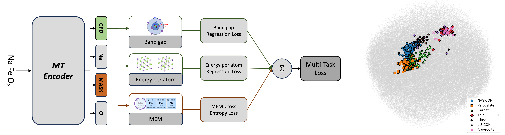

<h3 align="left">Hi 👋 I'm Elton Pan, a PhD student at MIT working on ML for materials science and chemistry</h3>

<h3 align="left">Ongoing/completed projects</h3>

• **Generative models** (conditional denoising diffusion models, VAEs) for **materials synthesis planning** using **molecular** and **crystalline materials** datasets (Nanoporous materials synthesis dataset: *Work in progress*; Nanoporous materials synthesis planning: *Work in progress*; Inorganic materials synthesis planning: <a href="https://pubs.acs.org/doi/full/10.1021/acs.chemmater.2c03010">Paper</a> | <a href="https://github.com/olivettigroup/interpretable-condition-prediction/">Code</a>)

  
• **Reinforcement learning** (deep Q-learning, policy gradient) for **inverse design of inorganic materials** (<a href="https://arxiv.org/abs/2210.11931">Paper</a> | <a href="https://github.com/eltonpan/RL_materials_generation">Code</a>)

• **Materials representation learning** (transformers) for inorganic materials property/synthesis prediction (*Work in progress*)
 (<a href="https://openreview.net/forum?id=wug7i3O7y1">Paper</a> | Code)
  
• **Natural language processing** (automated few-shot learning) for scientific data extraction (*Work in progress*)

• **Constrained RL** for process optimization (<a href="https://www.sciencedirect.com/science/article/abs/pii/S0098135421002404">Paper</a> | <a href="https://github.com/eltonpan/constrained_RL_process_optimization">Code</a>)

<h3 align="left">Useful links:</h3>

Google scholar: <a href="https://scholar.google.com/citations?user=2GTcE-0AAAAJ&hl=en">Google scholar</a>

Email: <a href = "mailto: eltonpan@mit.edu">eltonpan@mit.edu</a>

Linkedin: <a href="https://www.linkedin.com/in/eltonpan1/">Linkedin</a>
